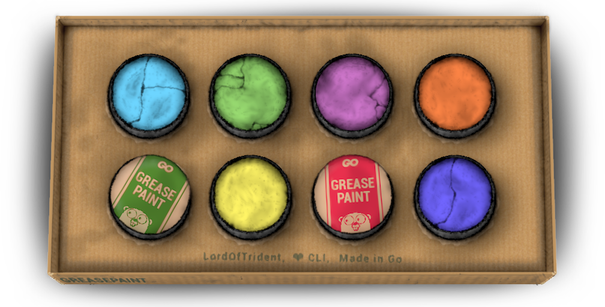

<a name="readme-top"></a>
<div align="center">
	<a href="./LICENSE">
		
	</a>
	<a href="https://github.com/LordOfTrident/greasepaint/graphs/contributors">
		
	</a>
	<a href="https://github.com/LordOfTrident/greasepaint/stargazers">
		
	</a>
	<a href="https://github.com/LordOfTrident/greasepaint/issues">
		
	</a>
	<a href="https://github.com/LordOfTrident/greasepaint/pulls">
		
	</a>
	<br><br><br>
	
	<h1 align="center">greasepaint</h1>
	<p align="center">💅 Go library for convenient CLI styling 🤡</p>
	<p align="center">
		<a href="#documentation">Documentation</a>
		·
		<a href="https://github.com/LordOfTrident/greasepaint/issues">Report Bug</a>
		·
		<a href="https://github.com/LordOfTrident/greasepaint/issues">Request Feature</a>
	</p>
	<br>
</div>

<details>
	<summary>Table of contents</summary>
	<ul>
		<li><a href="#introduction">Introduction</a></li>
		<li><a href="#usage">Usage</a></li>
		<li><a href="#example">Example</a></li>
		<li><a href="#documentation">Documentation</a></li>
		<li><a href="#bugs">Bugs</a></li>
	</ul>
</details>

## Introduction
A convenient CLI output styling library for Go which also handles omitting ansi sequences when
redirected to a file for sane output.

## Usage
Add this package to your project
```
$ go get github.com/LordOfTrident/greasepaint
```

And import it
```go
package main

import (
	"fmt"

	gp "github.com/LordOfTrident/greasepaint"
)

func main() {
	fmt.Println(gp.Center("Hello, world!"))
}
```

## Example
You can find examples in the [examples](./examples) folder.

## Documentation
Coming soon.

## Bugs
If you find any bugs, please, [create an issue and report them](https://github.com/LordOfTrident/greasepaint/issues).

<br>
<h1></h1>
<br>

<div align="center">
	<a href="https://go.dev/">
		
	</a>
	<a href="https://github.com/lordoftrident/ansi-go">
		
	</a>
	<p align="center">Made with ❤️ love</p>
</div>

<p align="right">(<a href="#readme-top">Back to top</a>)</p>
